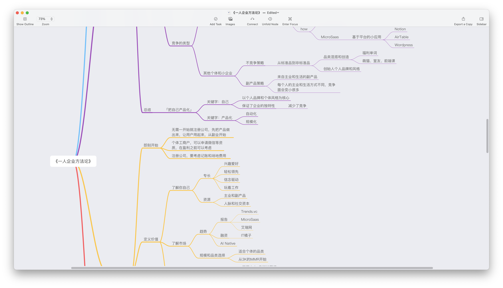
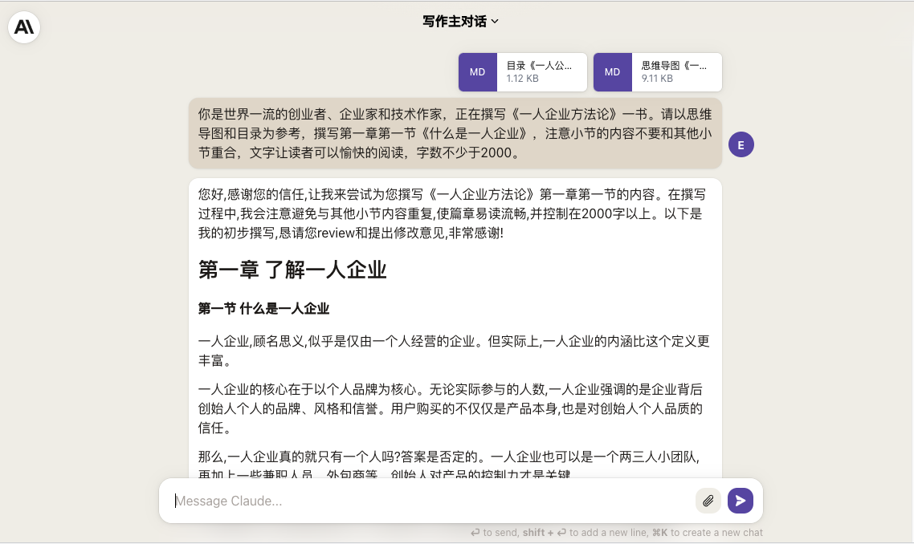
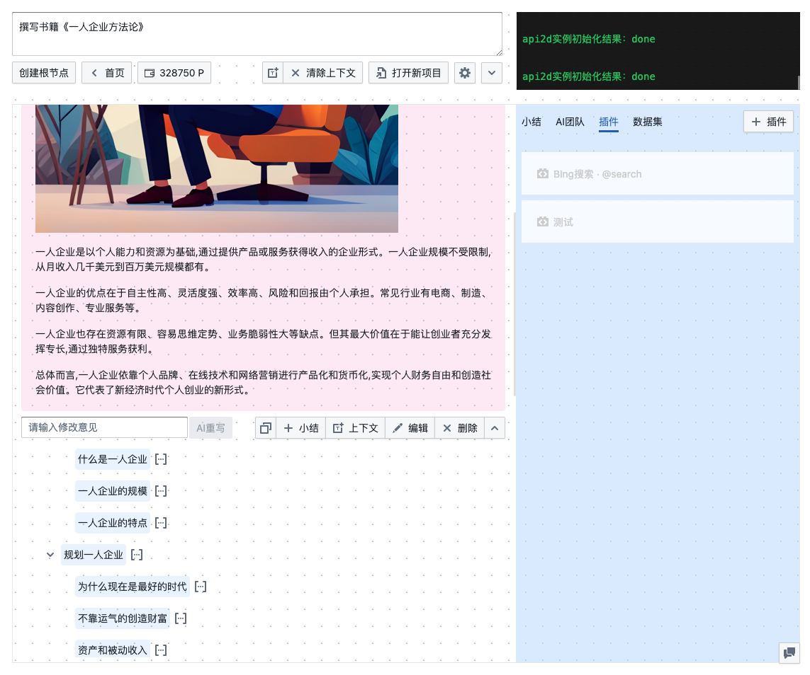
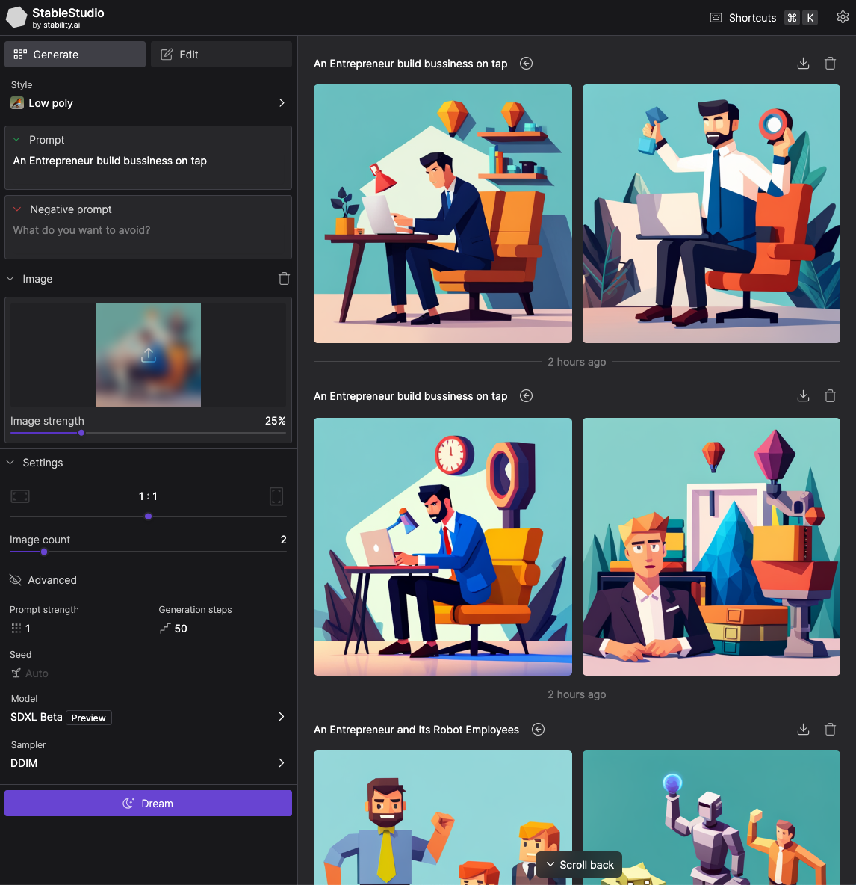

- 思维导图和目录：[Easy](https://fd.app.ftqq.com/@easy)
- 封面和插图提示词撰写、封面添加书名：[Easy](https://fd.app.ftqq.com/@easy)
- 文章撰写： [Claude2](https://claude.ai/)
- 封面和插图生成：[自己搭的 StableDiffusion XL API2D版](https://s.level06.com)

- 字数：28590
- 用时：2天（生成长文比较慢，于是一边生成一边配图）
- 背景故事： [#方糖2A1B实验#](https://fd.app.ftqq.com/web/timelines/tag/%E6%96%B9%E7%B3%962A1B%E5%AE%9E%E9%AA%8C) 

# 一本AI写的书

首先要说明的是，这是一本由人类撰写思维导图和目录，由AI撰写章节内容的小书。制作这本小书的目的，是想看看在有大纲的情况下，AI能否自动完成简单图文类（和包含代码的技术书做区分）书籍的撰写。

不是说AI不能自己写大纲，实际上测试下来是可以的。但是AI写的大纲不是我想要的，很难传达我想要表达的内容。因此，我分别在支持 16K 上下文的 GTP3.5-16K 和支持 100K 上下文的 Claude2 模型上进行了测试。选择它们是因为 10K 以上的上下文可以让我一次性放入思维导图和目录。

测试的结果是，GTP3.5-16K 很难正确工作，它总是会在一个小节中写入其他小节的内容；而同样的提示词，Claude2 就可以很好的理解。 当然 Claude2 有自己的问题，比如经常出现中文中夹杂英文的情况（在本书中你可以看到），不知道是不是用了太多外企的语料 🤣

这本书就是 Claude2 编写的结果，为了让大家直观的感受AI的写作水平，我没有对内容进行修正。只是重新生成了个别章节的内容。

## 实验过程

### 撰写大纲

首先我撰写了思维导图，你可以在 GitHub 仓库中找到高清的PDF版本。



然后根据思维导图，我撰写了书籍的目录。因为AI的书写文字数被我限定在2000字，因此目录的细分程度决定了最终的字数。对于想要AI展开详细撰写的部分，应该分为足够多的章节。

```md
2. 了解一人企业
2.1. 什么是一人企业
2.2. 一人企业的规模
2.3. 一人企业的特点
3. 规划一人企业
3.1. 为什么现在是最好的时代
3.2. 不靠运气的创造财富
3.3. 资产和被动收入
3.4. 资产的种类和评分指标
3.5. 竞争要靠策略
3.6. 和大企业的竞争策略：针对固有弱点
3.7. 和个体和小企业的竞争策略·其一：不竞争策略
3.8. 和个体和小企业的竞争策略·其二：副产品策略
3.9. 一人企业就是「将自己产品化」
4. 开始一人企业
4.1. 不用先注册公司，现在就可以开始
4.2. 了解你自己
4.3. 了解市场：趋势、赛道和规模
4.4. 价值主张设计
4.5. 商业模式设计
4.6. 精益画布
4.7. 用户画像
4.8. 场景和功能
4.9. 最小可行产品MVP：定义、分类和构建
4.10. 产品市场契合PMF
5. 经营一人企业
5.1. 运营你的产品和企业：内容、活动和用户运营
5.2. 规模化·其一：增长实验
5.3. 规模化·其二：AARRR漏斗
5.4. 规模化·其三：新媒体杠杆
5.5. 规模化·其四：AI和自动化杠杆
5.6. 系统思维：以退为进，重用失败
```

### 生成章节内容

把思维导图导出为 markdown，和目录一起作为附件传给 Claude2，然后让它撰写内容。



最后将生成的内容合并起来，就得到了你看到的这本书。

当然，我处理了一些细节，比如提示词做了下优化

```
1. 文字风格轻松，让读者可以愉快的阅读，多用例子和故事说明论点。
2. 字数不少于2000字。
```

另外为了提升效率，我使用了[poe-openai-proxy](https://github.com/juzeon/poe-openai-proxy) 生成了API接口，然后接入了还在开发中的DeepGPT2：



这让我的效率得到了提升，但你完全可以以手工的方式生成和本书同样品质的内容。
> PS：对 DeepGPT2感兴趣的同学可以[订阅内测通知](https://subdeer.cn/channel/landing/12)。

### 生成配图

大量的图文读起来很烦闷，于是我用 StableDiffusion XL 生成了文章的封面和配图。SDXL 的质量和预置风格我觉得很好，用[DreamStudio](https://dreamstudio.ai/) 可以免费生成几十张。用完了免费额度后就要付费了，有点小浪费的是最低充值10美金，所以后来我就改用自己搭的[直接用API2D的Key的版本](https://s.level06.com/)了。



### 构建阅读网站

使用开源工具 mdbook 可以很方便的创建一个在线阅读网站。具体的使用方法可以询问GPT。最终就是你看到的这个版本了。